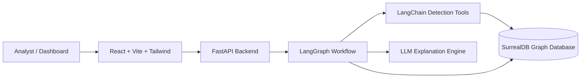
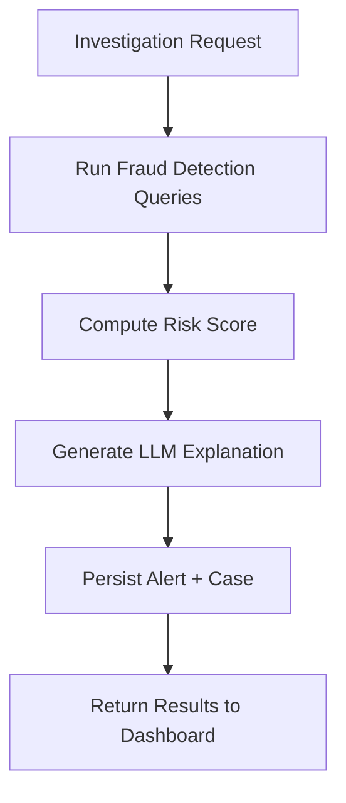
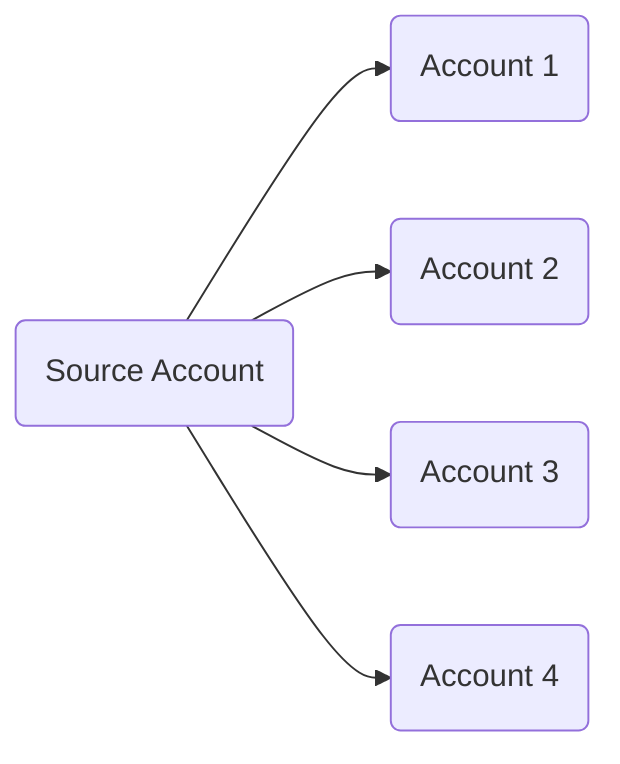
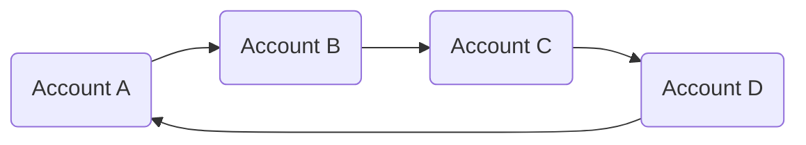
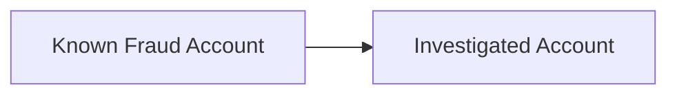

# Agentic Auditor – Explainable Fraud Detection (LangChain × SurrealDB)


Agentic Auditor is an **explainable fraud detection prototype** built using **LangChain agents, LangGraph orchestration, and SurrealDB graph queries**.

The system detects fraud patterns deterministically using graph queries and then generates **grounded explanations using an LLM**, ensuring that explanations never invent evidence.

This project demonstrates a **modern AI system architecture** combining:

* Graph databases
* Agent orchestration
* Deterministic detection
* LLM reasoning
* Interactive investigation UI

---

# System Architecture



Architecture layers:

| Layer               | Technology                           |
| ------------------- | ------------------------------------ |
| Frontend            | React + Vite + Tailwind + React Flow |
| API                 | FastAPI                              |
| Agent Orchestration | LangGraph                            |
| Detection Logic     | SurrealDB Graph Queries              |
| LLM Reasoning       | OpenAI                               |
| Persistence         | SurrealDB                            |

---

# Dashboard Preview

*(Add a screenshot once available)*

```
docs/dashboard.png
```

```md

```

Dashboard panels:

Left panel

* Transaction input
* Run investigation

Center panel

* Graph relationships

Right panel

* Risk score
* Evidence
* LLM explanation
* Alert + Case ID
* Analyst feedback

---

# Investigation Workflow



Pipeline flow:

```
transaction
   ↓
graph detections
   ↓
risk scoring
   ↓
LLM explanation
   ↓
alert + case creation
```

---

# Fraud Detection Motifs

The system identifies fraud through deterministic graph queries.

## Star Pattern (Fan-out Transfers)

One account sending funds to many destinations.



Score contribution:

```
+30 risk score
```

---

## Circular Flow

Funds circulate between accounts to obscure origin.



Score contribution:

```
+20 risk score
```

---

## Flagged Association

Account connected to known fraud entities.



Score contribution:

```
+25 risk score
```

---

# Risk Scoring

Deterministic scoring model:

| Pattern             | Score |
| ------------------- | ----- |
| Star pattern        | +30   |
| Circular flow       | +20   |
| Flagged association | +25   |

Severity thresholds:

| Score | Severity |
| ----- | -------- |
| ≥ 50  | High     |
| ≥ 25  | Medium   |
| < 25  | Low      |

---

# LangGraph State

The investigation state contains:

```
transaction_id
detections
risk_score
severity
evidence
explanation_short
explanation_long
alert_id
case_id
analyst_decision
```

---

# Backend Structure

Backend code lives in:

```
backend/
```

Key files:

```
backend/main.py
FastAPI entrypoint
```

```
backend/app/db.py
SurrealDB async client
```

```
backend/app/models.py
Pydantic models
```

```
backend/app/queries.py
Fraud detection queries
```

```
backend/app/tools.py
LangChain tool wrappers
```

```
backend/app/graph.py
LangGraph workflow
```

```
backend/app/explain.py
LLM explanation generation
```

```
backend/app/persist.py
Alert and case persistence
```

```
backend/app/api.py
API routes
```

---

# Frontend Structure

Frontend code lives in:

```
frontend/
```

Files:

```
frontend/index.html
frontend/vite.config.mts
frontend/tailwind.config.cjs
frontend/postcss.config.cjs
```

React application:

```
frontend/src/main.jsx
frontend/src/App.jsx
frontend/src/GraphView.jsx
frontend/src/api.js
frontend/src/index.css
```

---

# API Endpoints

## Health

```
GET /health
```

Response

```json
{
 "status": "ok"
}
```

---

## Investigate

```
POST /investigate
```

Request

```json
{
 "transaction_id": "transaction:txn_00001"
}
```

Response

```json
{
 "state": {
   "transaction_id": "...",
   "detections": [],
   "risk_score": 75,
   "severity": "high",
   "evidence": [],
   "explanation_short": "...",
   "explanation_long": "...",
   "alert_id": "alert:...",
   "case_id": "case_record:...",
   "analyst_decision": null
 }
}
```

---

## Feedback

```
POST /feedback
```

Request

```json
{
 "case_id": "case_record:...",
 "decision": "confirmed_suspicious",
 "note": "optional"
}
```

Response

```json
{
 "status": "ok"
}
```

---

# Environment Variables

Copy `.env.example` to `.env`

```
SURREAL_URL=http://localhost:8000
SURREAL_USER=root
SURREAL_PASS=root
SURREAL_NS=hackathon
SURREAL_DB=agentic_auditor

OPENAI_API_KEY=your-openai-api-key
LLM_MODEL=gpt-4o-mini
```

Frontend variable:

```
VITE_API_BASE_URL=http://localhost:8001
```

---

# Installation

## Backend

```
cd backend
python -m venv .venv
source .venv/bin/activate
pip install -r requirements.txt
```

Windows

```
.venv\Scripts\activate
```

---

## Frontend

```
cd frontend
npm install
```

---

# Running the Backend

```
cd backend
uvicorn main:app --reload --port 8001
```

Test endpoint

```
curl http://localhost:8001/health
```

---

# Running the Frontend

```
cd frontend
npm run dev
```

Open

```
http://localhost:5173
```

---

# Demo Flow

1. Open dashboard

```
http://localhost:5173
```

2. Enter a seeded transaction ID

Examples

```
account:acct_231
```

3. Click **Run Investigation**

The system will:

1. Run SurrealDB fraud queries
2. Calculate risk score
3. Generate LLM explanation
4. Persist alert + case
5. Display relationship graph

Right panel shows:

* Risk score
* severity
* explanation
* evidence
* alert ID
* case ID
* analyst feedback

---

# Design Decisions & Tradeoffs

## Deterministic Detection First

Fraud patterns are detected with **explicit graph queries**, not ML models.

Advantages:

* Explainable
* Auditable
* Deterministic behavior
* No hallucinated risk signals

This mirrors many **real-world financial compliance systems**.

---

## LLM Used Only for Explanation

LLMs are **not used for fraud detection**.

They are only used to transform structured evidence into analyst-readable explanations.

Benefits:

* Prevents hallucinated fraud signals
* Keeps detection logic auditable
* Improves analyst productivity

---

## Graph Database vs Relational DB

Fraud detection often requires identifying:

* transaction networks
* shared devices
* shared IPs
* circular flows

Graph databases make these patterns **far easier to query**.

---

## Agent Workflow with LangGraph

LangGraph provides:

* explicit workflow state
* deterministic pipeline
* easy debugging

Pipeline nodes:

```
run_detections
score_risk
generate_explanation
persist_alert_case
```

---

# Future Improvements

Potential production extensions:

* Real-time fraud detection via Kafka streams
* Graph embeddings for anomaly detection
* ML risk scoring models
* Investigator case management workflows
* Analyst feedback loop for model retraining
* Multi-hop graph traversal detection
* Device fingerprinting signals

---

# License

MIT
